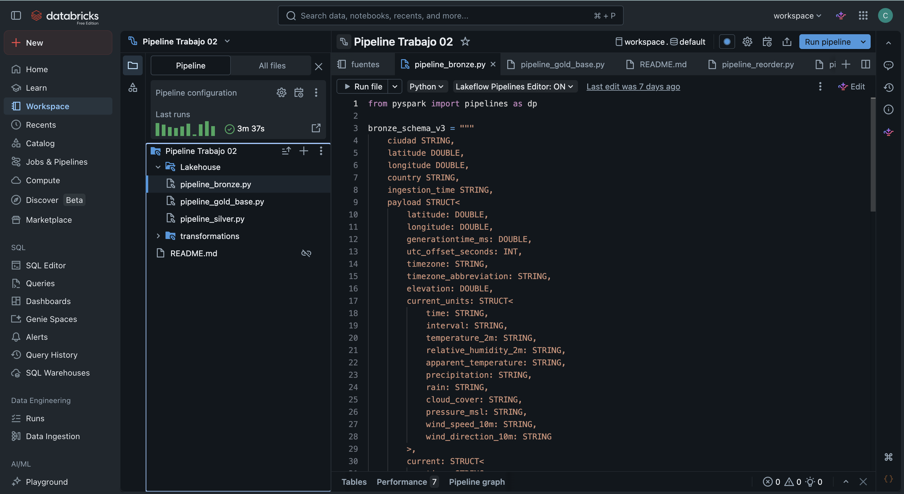
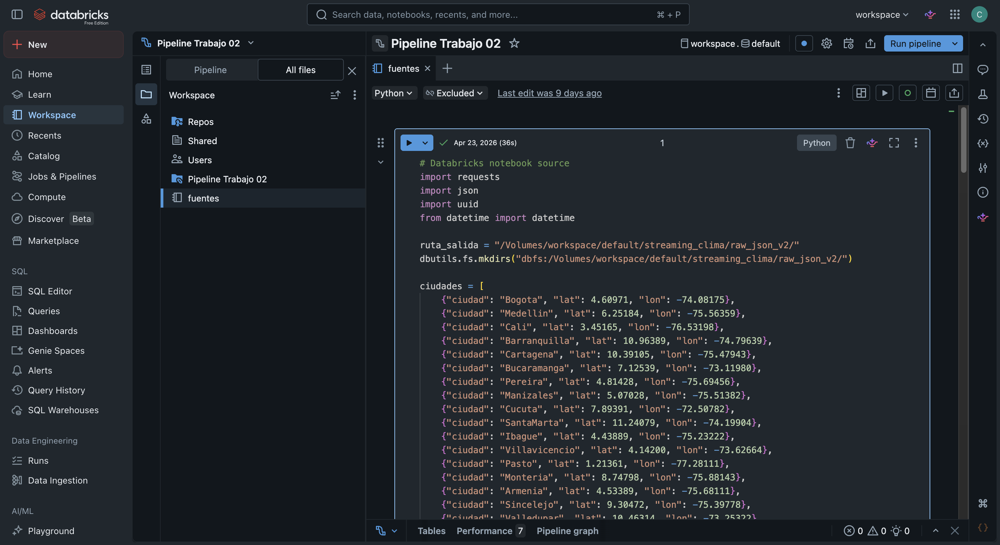
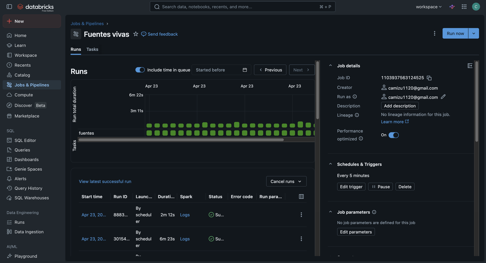
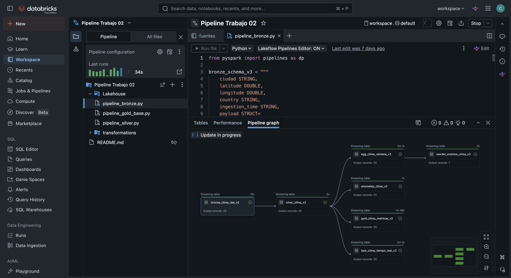
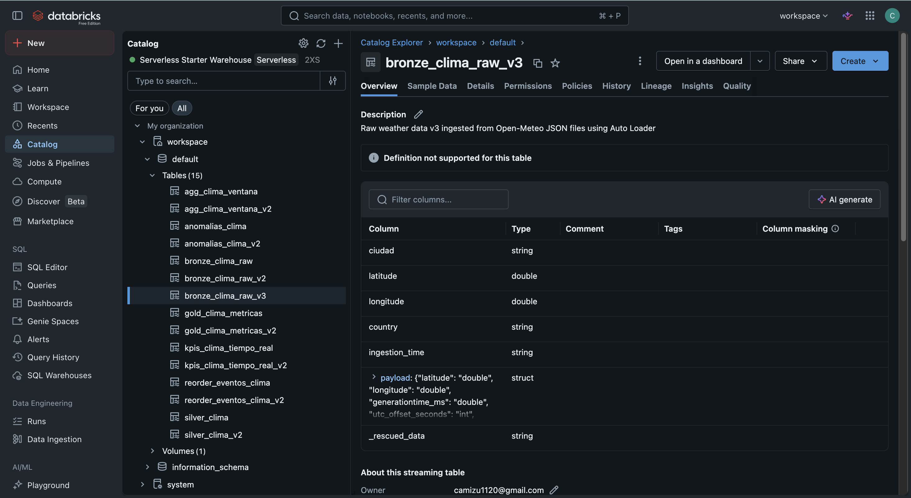
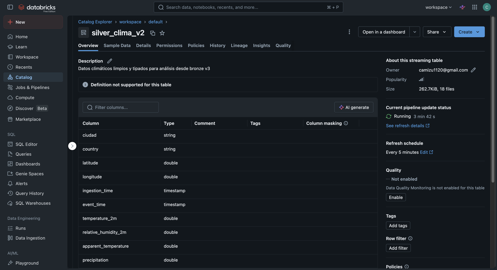
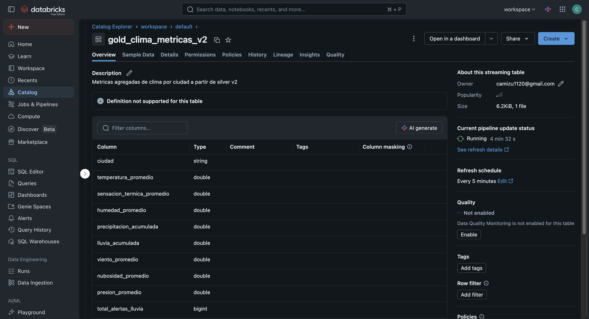
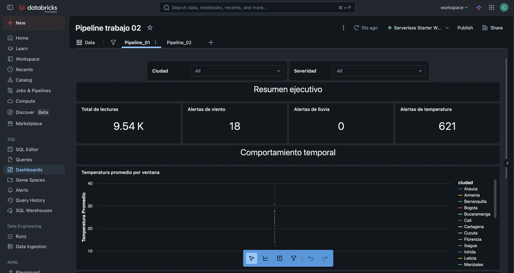
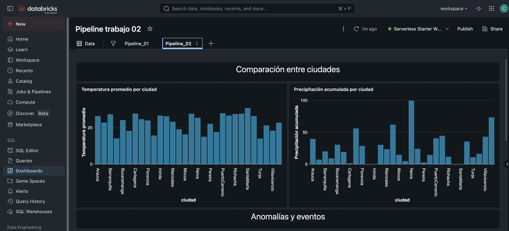
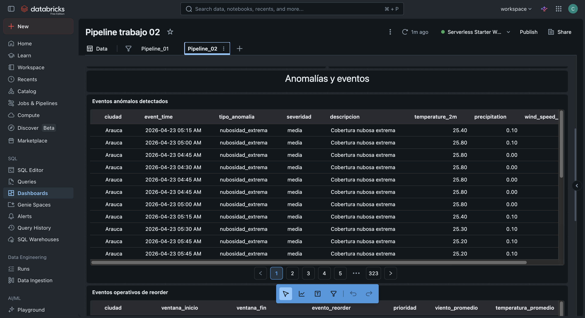

<p align="center">
  
</p>

# Pipeline de Streaming Climático en Databricks

Este repositorio contiene los archivos necesarios para reproducir un flujo de datos en Databricks orientado al monitoreo climático en tiempo casi real.

El proyecto implementa una arquitectura Lakehouse con capas Bronze, Silver y Gold, usando archivos JSON generados desde la API pública de Open-Meteo y procesados posteriormente mediante Lakeflow Declarative Pipelines / Spark Structured Streaming en Databricks.

Como el trabajo original fue construido dentro de un workspace de Databricks que no se puede compartir directamente, este repositorio permite documentar y entregar el proyecto de forma reproducible: código fuente, estructura del pipeline, consultas SQL y guía para construir el dashboard.

---

## 1. Objetivo del proyecto

Construir un flujo de datos en Databricks que permita:

- Obtener información climática desde una API pública de forma continua.
- Registrar los eventos climáticos en archivos JSON generados de manera incremental.
- Incorporar los datos en su estado original dentro de la capa Bronze.
- Depurar y organizar la información para transformarla en datos confiables en la capa Silver.
- Generar métricas, KPIs, detección de anomalías y eventos de decisión en la capa Gold.
- Presentar los resultados a través de dashboards en Databricks AI/BI.

---

## 2. Arquitectura general

```text
API Open-Meteo
     |
     v
Notebook fuente externa
     |
     v
Archivos JSON en Databricks Volumes
     |
     v
Pipeline Trabajo 02
     |
     ├── Lakehouse
     │   ├── Bronze
     │   ├── Silver
     │   └── Gold base
     │
     └── Transformations
         ├── KPIs
         ├── Anomalías
         ├── Agregaciones por ventana
         └── Eventos de reorder
     |
     v
AI/BI Dashboard
```

---

## 3. Estructura del repositorio

```text
databricks-clima-streaming/
│
├── README.md
├── requirements.txt
│
├── fuentes/
│   └── fuente_open_meteo.py
│
├── pipeline_trabajo_02/
│   ├── Lakehouse/
│   │   ├── pipeline_bronze.py
│   │   ├── pipeline_silver.py
│   │   └── pipeline_gold_base.py
│   │
│   └── transformations/
│       ├── pipeline_agregaciones_ventana.py
│       ├── pipeline_anomalias.py
│       ├── pipeline_kpis_tiempo_real.py
│       └── pipeline_reorder.py
│
├── sql/
│   └── consultas_dashboard.sql
│
├── docs/
│   ├── arquitectura.md
│   ├── guia_dashboard.md
│   └── evidencias/
│       ├── 01_estructura_pipeline_databricks.png
│       ├── 02_notebook_fuente_open_meteo.png
│       ├── 03_generacion_archivos_json.png
│       ├── 04_pipeline_ejecucion_exitosa.png
│       ├── 05_tabla_bronze.png
│       ├── 06_tabla_silver.png
│       ├── 07_tabla_gold.png
│       ├── 08_dashboard_kpis.png
│       └── 09_dashboard_graficas.png
│
└── data/
    └── sample_event.json

```

---

## 4. Tecnologías utilizadas

- Databricks
- Apache Spark Structured Streaming
- Lakeflow Declarative Pipelines
- Delta Lake
- Unity Catalog
- Databricks Volumes
- Python
- SQL
- API Open-Meteo
- Databricks AI/BI Dashboards

---

## 5. Componentes del proyecto

### 5.1 Fuente externa

Archivo:

```text
fuentes/fuente_open_meteo.py
```

Este notebook se ejecuta por fuera del pipeline. Su función es consultar la API de Open-Meteo y generar archivos JSON en el volumen de Databricks.

Ruta utilizada:

```text
/Volumes/workspace/default/streaming_clima/raw_json_v2/
```

Cada ejecución genera un archivo JSON por ciudad monitoreada.

Ciudades incluidas:

```text
Bogota, Medellin, Cali, Barranquilla, Cartagena, Bucaramanga,
Pereira, Manizales, Cucuta, SantaMarta, Ibague, Villavicencio,
Pasto, Monteria, Armenia, Sincelejo, Valledupar, Popayan,
Neiva, Riohacha, Tunja, Florencia, Yopal, Quibdo, Arauca,
Mocoa, SanAndres, Leticia, Inirida, PuertoCarrenio
```

Variables consultadas:

- Temperatura actual.
- Humedad relativa.
- Sensación térmica.
- Precipitación.
- Lluvia.
- Nubosidad.
- Presión atmosférica.
- Velocidad del viento.
- Dirección del viento.

---

### 5.2 Pipeline Lakehouse

Carpeta:

```text
pipeline_trabajo_02/
```

Esta carpeta representa el pipeline creado en Databricks.

La estructura usada en Databricks fue:

```text
Pipeline Trabajo 02
│
├── Lakehouse
│   ├── pipeline_bronze.py
│   ├── pipeline_gold_base.py
│   └── pipeline_silver.py
│
└── transformations
    ├── pipeline_agregaciones_ventana.py
    ├── pipeline_anomalias.py
    ├── pipeline_kpis_tiempo_real.py
    └── pipeline_reorder.py
```

---

## 6. Capas del flujo

### 6.1 Bronze

Archivo:

```text
pipeline_trabajo_02/Lakehouse/pipeline_bronze.py
```

Tabla generada:

```text
bronze_clima_raw_v2
```

Responsabilidad:

- Leer los archivos JSON crudos almacenados en el volumen.
- Incorporar los datos de forma incremental utilizando Auto Loader.
- Mantener la trazabilidad de cada archivo de origen.
- Registrar el momento en que cada dato es procesado.

---

### 6.2 Silver

Archivo:

```text
pipeline_trabajo_02/Lakehouse/pipeline_silver.py
```

Tabla generada:

```text
silver_clima
```

Responsabilidad:

- Leer la tabla Bronze.
- Extraer los campos relevantes del `payload.current`.
- Convertir fechas y valores numéricos.
- Crear banderas de alerta.

Campos principales:

```text
ciudad
latitude
longitude
country
ingestion_time
event_time
temperature_2m
relative_humidity_2m
apparent_temperature
precipitation
rain
cloud_cover
pressure_msl
wind_speed_10m
wind_direction_10m
alerta_lluvia
alerta_viento
alerta_temperatura
```

Reglas de alerta:

```text
alerta_lluvia       = 1 si precipitation >= 5
alerta_viento       = 1 si wind_speed_10m >= 35
alerta_temperatura  = 1 si temperature_2m >= 30
```

---

### 6.3 Gold base

Archivo:

```text
pipeline_trabajo_02/Lakehouse/pipeline_gold_base.py
```

Tabla generada:

```text
gold_clima_metricas
```

Responsabilidad:

- Calcular métricas agregadas por ciudad.
- Preparar datos resumidos para el dashboard.

Métricas generadas:

```text
temperatura_promedio
humedad_promedio
sensacion_termica_promedio
precipitacion_acumulada
lluvia_acumulada
nubosidad_promedio
presion_promedio
viento_promedio
total_alertas_lluvia
total_alertas_viento
total_alertas_temperatura
total_eventos
ultimo_evento
```

---

## 7. Transformaciones adicionales

### 7.1 KPIs en tiempo real

Archivo:

```text
pipeline_trabajo_02/transformations/pipeline_kpis_tiempo_real.py
```

Tabla generada:

```text
kpis_clima_tiempo_real
```

Indicadores:

- Total de lecturas.
- Ciudades monitoreadas.
- Alertas por lluvia.
- Alertas por viento.
- Alertas por temperatura.
- Último evento registrado.

---

### 7.2 Anomalías climáticas

Archivo:

```text
pipeline_trabajo_02/transformations/pipeline_anomalias.py
```

Tabla generada:

```text
anomalias_clima
```

Reglas:

```text
precipitation >= 10      -> lluvia_extrema
wind_speed_10m >= 35     -> viento_extremo
temperature_2m >= 30     -> temperatura_alta
```

---

### 7.3 Agregaciones por ventana

Archivo:

```text
pipeline_trabajo_02/transformations/pipeline_agregaciones_ventana.py
```

Tabla generada:

```text
agg_clima_ventana
```

Esta tabla agrupa los eventos por ciudad en ventanas de 10 minutos.

Métricas calculadas por ventana:

- Temperatura promedio.
- Humedad promedio.
- Precipitación acumulada.
- Lluvia acumulada.
- Viento promedio.
- Total de alertas.
- Total de eventos.

---

### 7.4 Eventos de reorder

Archivo:

```text
pipeline_trabajo_02/transformations/pipeline_reorder.py
```

Tabla generada:

```text
reorder_eventos_clima
```

Regla aplicada:

```text
precipitacion_acumulada > 15
```

Evento generado:

```text
reordenar_insumos_lluvia
```

---

## 8. Paso a paso para reproducir en Databricks

### Paso 1. Crear el volumen

En Databricks se debe crear o verificar la existencia del volumen:

```text
/Volumes/workspace/default/streaming_clima/
```

Dentro del volumen se debe usar la carpeta:

```text
/Volumes/workspace/default/streaming_clima/raw_json_v2/
```

El notebook fuente también la crea automáticamente con:

```python
dbutils.fs.mkdirs("dbfs:/Volumes/workspace/default/streaming_clima/raw_json_v2/")
```

---

### Paso 2. Importar el notebook fuente

Importar el archivo:

```text
fuentes/fuente_open_meteo.py
```

Luego ejecutarlo manualmente.

Al finalizar, debe mostrar archivos generados como:

```text
Medellin_20260420_181025_8f4a1f9f3c7b4e2b9b8e7b7f82a92b12.json
Bogota_20260420_181025_31c3b1b4561241ad82f011a2e2a77231.json
```

También debe listar la ruta:

```python
display(dbutils.fs.ls("dbfs:/Volumes/workspace/default/streaming_clima/raw_json_v2/"))
```

---

### Paso 3. Crear el pipeline

Crear un pipeline en Databricks con el nombre:

```text
Pipeline Trabajo 02
```

Agregar estos archivos como fuentes del pipeline:

```text
pipeline_trabajo_02/Lakehouse/pipeline_bronze.py
pipeline_trabajo_02/Lakehouse/pipeline_silver.py
pipeline_trabajo_02/Lakehouse/pipeline_gold_base.py
pipeline_trabajo_02/transformations/pipeline_agregaciones_ventana.py
pipeline_trabajo_02/transformations/pipeline_anomalias.py
pipeline_trabajo_02/transformations/pipeline_kpis_tiempo_real.py
pipeline_trabajo_02/transformations/pipeline_reorder.py
```

---

### Paso 4. Validar rutas y nombres

Antes de ejecutar el pipeline, validar que la ruta de Bronze coincida con la ruta donde la fuente escribe los JSON:

```python
RAW_PATH = "/Volumes/workspace/default/streaming_clima/raw_json_v2/"
```

También validar el catálogo y esquema usados en los archivos:

```python
CATALOG = "workspace"
SCHEMA = "default"
```

Si el workspace usa otros nombres, se deben modificar esos valores en los scripts.

---

### Paso 5. Ejecutar el pipeline

Ejecutar el pipeline desde Databricks con la opción:

```text
Start
```

Si se hacen cambios fuertes en el esquema, puede ser necesario usar:

```text
Full refresh
```

---

### Paso 6. Verificar tablas creadas

Luego de ejecutar el pipeline, deben existir las siguientes tablas:

```text
workspace.default.bronze_clima_raw_v2
workspace.default.silver_clima
workspace.default.gold_clima_metricas
workspace.default.kpis_clima_tiempo_real
workspace.default.anomalias_clima
workspace.default.agg_clima_ventana
workspace.default.reorder_eventos_clima
```

Se puede validar con consultas como:

```sql
SELECT * FROM workspace.default.silver_clima LIMIT 10;
```

```sql
SELECT * FROM workspace.default.gold_clima_metricas;
```

---

## 9. Dashboard

El dashboard se construye en Databricks AI/BI Dashboards usando las consultas del archivo:

```text
sql/consultas_dashboard.sql
```

También se incluye una guía detallada en:

```text
docs/guia_dashboard.md
```

---

## 10. Gráficas sugeridas

### KPIs

- Total de lecturas.
- Ciudades monitoreadas.
- Total de alertas por lluvia.
- Total de alertas por viento.
- Total de alertas por temperatura.

### Barras

- Temperatura promedio por ciudad.
- Precipitación acumulada por ciudad.
- Viento promedio por ciudad.
- Nubosidad promedio por ciudad.

### Línea temporal

- Evolución de temperatura por ventana de 10 minutos.
- Evolución de precipitación por ventana.
- Evolución de viento por ventana.

### Scatter plots

- Temperatura vs humedad.
- Viento vs precipitación.

### Tablas

- Tabla de anomalías climáticas.
- Tabla de eventos de reorder.

---

## 11. Consultas principales del dashboard

### KPI total de lecturas

```sql
SELECT
  SUM(total_eventos) AS total_lecturas
FROM workspace.default.gold_clima_metricas;
```

### Temperatura promedio por ciudad

```sql
SELECT
  ciudad,
  temperatura_promedio
FROM workspace.default.gold_clima_metricas
ORDER BY temperatura_promedio DESC;
```

### Precipitación acumulada por ciudad

```sql
SELECT
  ciudad,
  precipitacion_acumulada
FROM workspace.default.gold_clima_metricas
ORDER BY precipitacion_acumulada DESC;
```

### Scatter plot: temperatura vs humedad

```sql
SELECT
  ciudad,
  event_time,
  temperature_2m,
  relative_humidity_2m,
  precipitation,
  wind_speed_10m
FROM workspace.default.silver_clima;
```

Configuración sugerida:

```text
Tipo: Scatter plot
Eje X: temperature_2m
Eje Y: relative_humidity_2m
Color: ciudad
Tamaño opcional: precipitation
```

### Scatter plot: viento vs precipitación

```sql
SELECT
  ciudad,
  event_time,
  wind_speed_10m,
  precipitation,
  temperature_2m
FROM workspace.default.silver_clima;
```
---

## 12. Programación del flujo

Para simular un flujo continuo:

1. Programar el notebook `fuente_open_meteo.py` como un Job.
2. Ejecutarlo cada 5 o 10 minutos.
3. Mantener el pipeline activo o ejecutarlo con programación periódica.
4. Actualizar el dashboard con las tablas Gold.

Flujo recomendado:

```text
Job fuente cada 5 minutos
        |
        v
Archivos JSON incrementales
        |
        v
Pipeline Lakehouse
        |
        v
Tablas Gold
        |
        v
Dashboard
```

---

## 13. Problemas comunes y solución

### Error: no se encuentran archivos JSON

Validar que el notebook fuente haya generado archivos en:

```text
/Volumes/workspace/default/streaming_clima/raw_json_v2/
```

Comando de validación:

```python
display(dbutils.fs.ls("dbfs:/Volumes/workspace/default/streaming_clima/raw_json_v2/"))
```

---

### Error: el pipeline no encuentra tablas

Validar que cada archivo del pipeline tenga al menos una función decorada con `@dp.table`.

Ejemplo:

```python
@dp.table(
    name="silver_clima"
)
def silver_clima():
    ...
```

## 14. Evidencias del desarrollo

Esta sección presenta capturas de pantalla del proceso realizado en Databricks, con el fin de evidenciar la creación de la fuente de datos, la estructura del pipeline, la generación de tablas y la construcción del dashboard.

### Estructura del pipeline en Databricks



### Notebook fuente Open-Meteo



### Archivos JSON generados



### Ejecución del pipeline



### Tablas generadas







### Dashboard final







---
